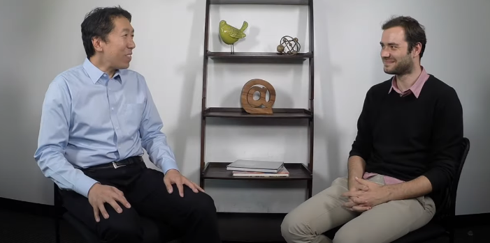

# Using OpenAI's Whipser to Transcribe the famous **Hereos in Deep Learning** Series by Professor Andrew NG.

When I first listened to this series, I fall in love with it(Back in 2020). I always wanted a good transcribed version of it, and OPEN AI's Whisper came to rescue.



We are using `pytube` to download the interviews of the professors in the audio format, using Whisper to Transcribe them and fpdf to store them.
## Run
You can run the code by running
```
$ python transcribe_interviews.py
```

Make sure to have ffmpeg and rust installed in your system as well, see Whispers Github for more details.